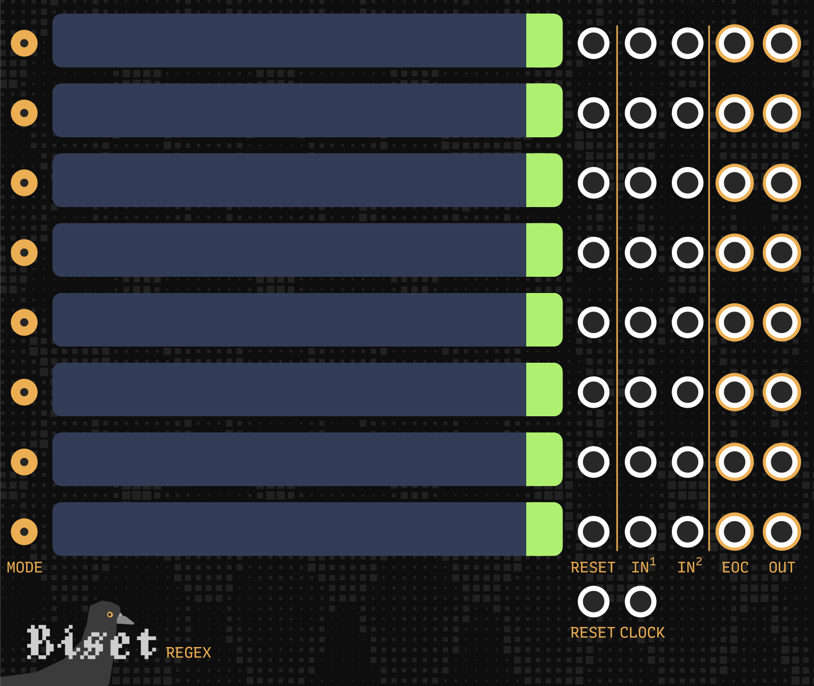
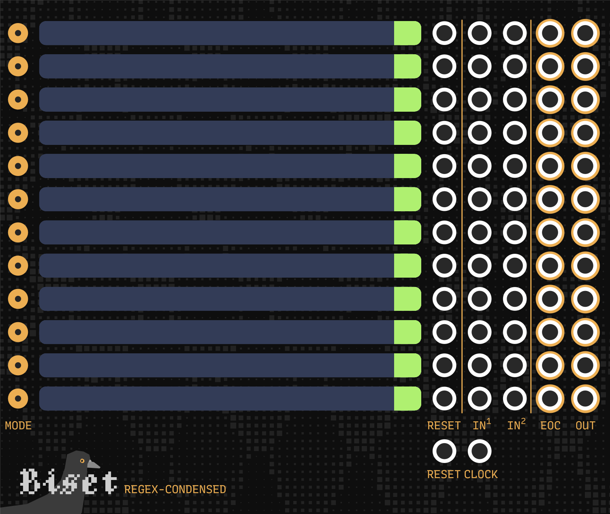

# Biset

**Biset** sequencing / performing modules.

## Segfault

**Segfault** is designed to be used with **VCV - Midi to CV** module while
performing on your Qwerty or Midi keyboard.
It allows you to send triggers on specific notes and to disable some of them.

It might sound weird but it actually allows you to **rethink your keyboard
layout** !

As an **exemple**, I **disable all the black keys** and use them as **triggers**
to activate other things on my patch.
The **remaining white keys**, which make up the **major scale**, can then be
quantized to any other **7 notes scale** (so most of the scales).
I can then play any 7 notes scale only with the **white keys** and use the
**black keys** gates / triggers to change the synth, the scale / quantizer or
anything else :)

Of course, you can use it in a different way. Like by using the notes triggers
to activate a different synth for every note.

**Segfault** takes **pitch** and **gate** (polyphonic) as input and outputs the
modified gate (if needed).

If the **gate** input is not provided, it is considered up by default.

## Regex & Regex-Condensed

Here is a [walk through](https://www.youtube.com/watch?v=hXMN2y9V8K0) of the modules.

I also published a small [demo](https://www.youtube.com/watch?v=6aDPGLpFWYQ)
where I use **Regex** both as a drum & pitch sequencer and as a glitchy VCO.

**Regex** is a text based pattern sequencer.
It can generate both clock (rythm) and pitch sequences.

It has been thought for performance as a live coding device. You can easily
build sequences, rythm and/or pitch/cv and connect them.

**Regex** is made of 8 (12 for the condensed version) expressions, and 2 inputs:
- An expression is made of a **screen**, a **mode switch**, **3 inputs** and **2 outputs**:
	- `Screen` Expression editor
	- `Mode switch` Expression mode switch (**clock** or **pitch**)
	- `Input reset` Reset the running expression
	- `Input 1 (clock)` 1st input of the expression. Replace master clock if connected.
	- `Input 2` 2nd input of the expression. Used as an additional clock on **clock** mode and as pitch offset on **pitch** mode.
- Input reset: Reset all running expressions
- Input clock master: Clock all expressions

### Expression

An expression is a string defining a pattern generating **clock** (rythm) or **pitch** (or CV).

It is based on sequences that are made of:

- `A type` (foreward, backward, pingpong, random, etc.) OPTIONAL (foreward by default)
- `A series of values` (number, pitch, recursive sequence) can be enclosed in brackets for clarity
- `A modulator`	OPTIONAL

Here are a few valid expressions:

- `c,d,e`
- `0,1,2,3`
- `(0,1,2,3)`
- `?0,1,2,3`
- `>(0,1,2,?(3,4,5))`
- `^(1,2,3)%16`
- `^(1,2,3,4)x4`
- `(a,b,c,((d,e,f))%1)`

To run an expression, you should press **Enter** while on the corresponding
led display. You can also press **Ctrl + Enter** to run all expressions.
An expression can be stopped by pressing **Escape**.
You can use **Ctrl + Arrow** to jump to other expressions.

#### Sequence types

By default, a sequence is set with the **foreward** type.

Here is a list of available types:

- `>` **Foreward**		Read the sequence foreward
- `<` **Backward**		Read the sequence backward
- `^` **Ping-pong**		Read the sequence foreward and backward
- `@` **Shuffle**		Read the sequence shuffled
- `?` **Random**		Pick an item of the sequence
- `!` **X-Random**		Pick an item of the sequence avoiding the last picked
- `$` **Walk**			Random walk in the sequence

#### Sequence values

Expressions values can be numbers or pitch (with optionnal octave).
Both numerical and pitch values can be used in **clock** and **pitch** modes.
You can also use other sequences as values, allowing you to build complex
patterns.

Here are a few valid values:

- `C`
- `c`
- `c#`
- `cb`
- `c5`
- `3`
- `16`
- `-4`
- `-17`

Values follow the **v/oct** rule, even for numerical values.

`0` returns **0 volt** while `12` returns **1 volt**.

`c4` returns **0 volt** while `c3` returns **-1 volt**.

#### Sequence modulators

Modulator define the sequence behavior through time.
When no modulator is used, the sequence is read once.

The `xN` modulator simply asks for the sequence to be read N times.

The `%N` modulator varies on the **expression mode**.
On **clock mode**, it loops the sequence until N clock triggers have been
reached on the **input**, allowing you to easily build "regular" rythms.
On **pitch mode**, it loops the sequence until N values have been **output**.

### Clock mode

The **clock mode** generates rythm. It uses the **master clock input**
or the expression **1st input** as main clock and can use the expression
**2nd input** as additional clock (resulting in a more complex rythm).

The sequence values acts like clock dividers.

Exemples:

- `>1,2`				xx.|
- `<1,2`				x.x|
- `^1,2`				xx.x.x|
- `>1,2,3`				xx.x..|
- `>1,2,3%8`			xx.x..|xx|
- `>1,2,3%16`			xx.x..|xx.x..|xx.x|
- `>(1,2,((3,4))%1)%16`	xx.x..|xx.x...|xx.|

### Pitch mode

The **pitch mode** generates pitch on each trigger received via the
**master clock input** or the expression **1st input**.

The expression **2nd input** allows you to combine pitch sequences.
It acts as an **offset** to the output pitch.

Exemple:

- `>a,b,c,d,e,f,g`							Generate pitch on 1 octave
- `?0,0,0,12,12,24` or `?c4,c4,c4,c5,c5,c6`	Generate random octave

By connecting one expression to the other (both way are possible),
you add these random octave values to the linear sequence and offset it.

## Tracker suite

Work in progress.

The **Tracker Suite** aims to provide a set of connected modules made for
*traditional* composition and live performance.
It is pattern based with a timeline and a pattern matrix.
Patterns editor is based on a tracker.

It will be made of:

- **Tracker** (main composition module)
- **T-Synth** (poly output cv / trigger / ... from tracker)
- **T-Drum** (output splitted trigger / cv ... from tracker)
- **T-Clock** (divided / multiplied clock from tracker)
- **T-Phase** (divided / multiplied clock phase from tracker with wave shaping for LFO)
- **T-State** (Run / reset / end of song / end of pattern / ... from tracker)
- **T-Temp** (quantize signal to Tracker settings)
