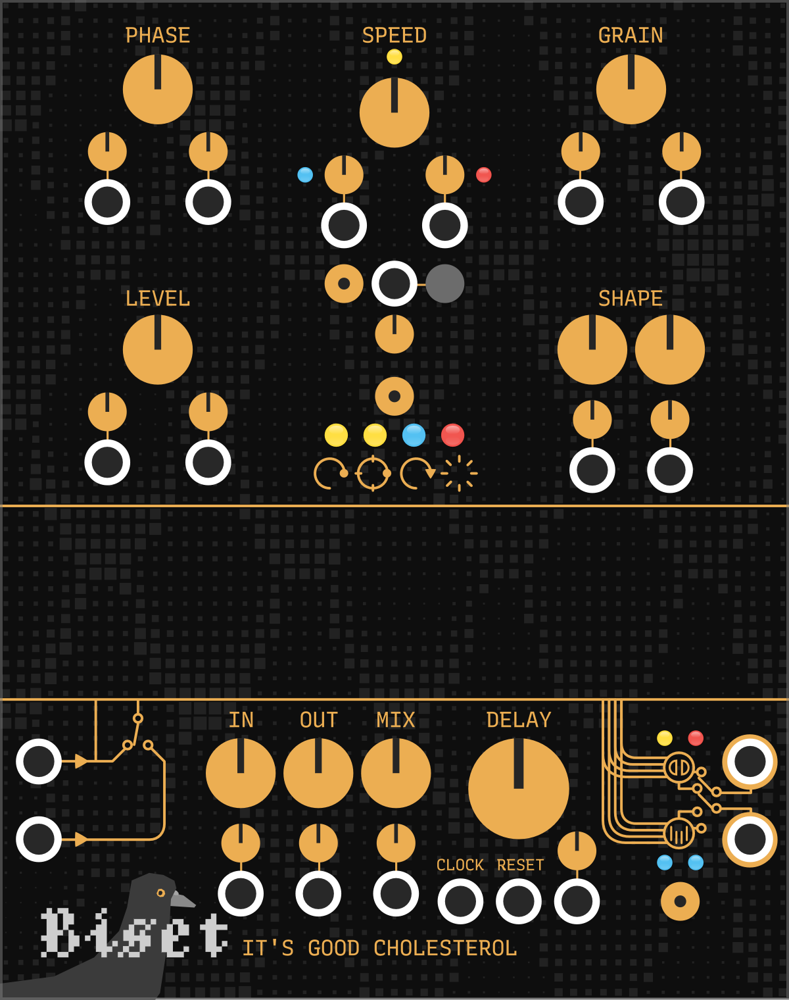
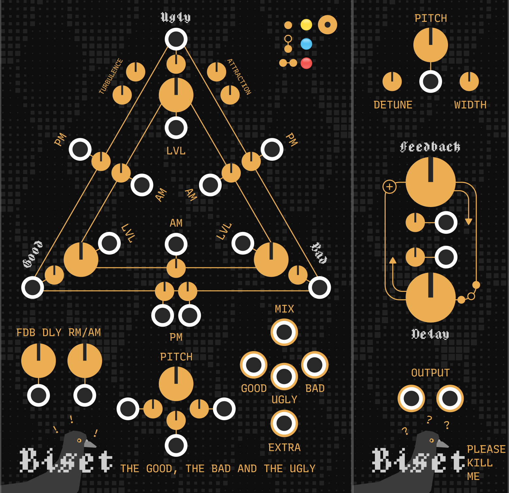
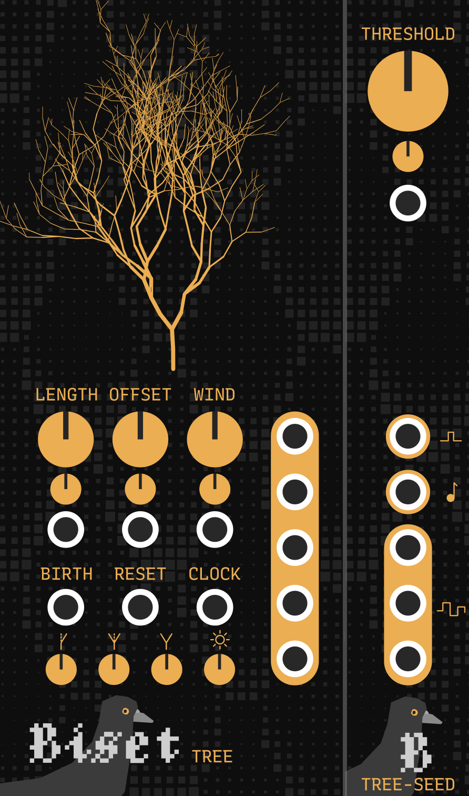
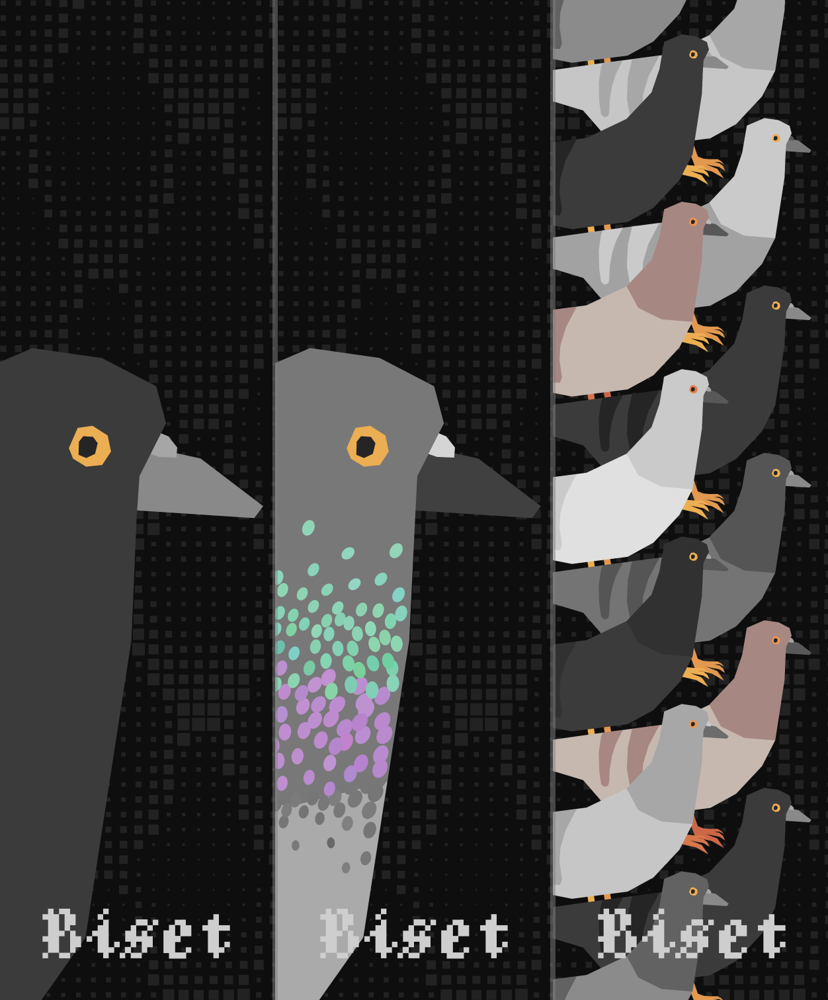
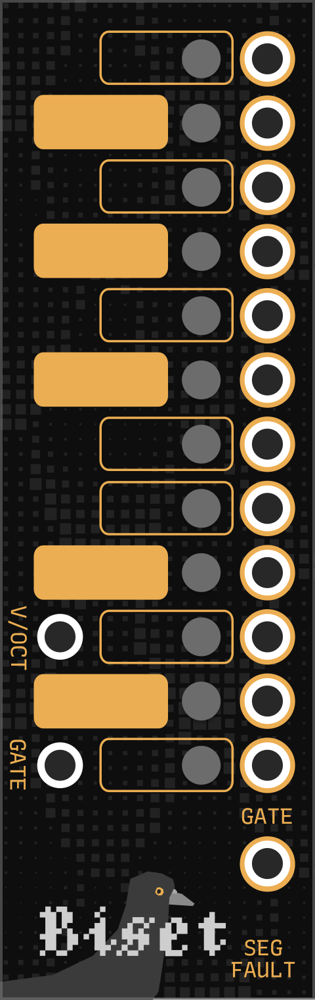

# Biset

**Biset** sequencing / performing / vco modules.

The plugin is no longer updated as I'm trying to focus on music creation. I hope you can still enjoy the modules 😄

For **question**, **bug report** or **feature request**, feel free to contact me
by email or create a **github issue** (easier for me for report or request).
You can see the past and comming updates on the [changelog](./CHANGELOG.md).

## It's good cholesterol and Omega friends

**It's good cholesterol** is a sound design sandbox. It can do a lot. Tap delay,
reverse delay, granular, even VCO. Basically, it's a buffer that record a stereo
input and allows you to read that buffer with multiple playhead through
polyphonic modulation.

[Igc manual](./doc/Manual-IGC.pdf)

## VCOs

**The Good, the Bad and the Ugly** and **Please kill me** are VCOs based on
**Frequency** (**Phase**), **amplitude** and **ring** modulation.
They are designed to add some spring and inertia to sound with some unusual
sound design and controls !

[VCOs manual](./doc/Manual-VCOs.pdf)

## Tracker

**Tracker** is a series of modules building a complex sequencer based on
**patterns** arranged in a **timeline**.
It can be used to build complex **tracks** or for **live performance**.

[Omri Cohen walk through](https://www.youtube.com/watch?v=cjwxdw0tEjI)

[Tracker walk through](https://www.youtube.com/watch?v=dUq9HsWwDsw)

[Tracker manual](./doc/Manual-Tracker.pdf)

## Regex

**Regex** and **Regex-Condensed** are **live coding** modules. They can generate
**clock** (rythm), **pitch** and **modulation** sequences.

[Regex walk through](https://www.youtube.com/watch?v=hXMN2y9V8K0)

[Regex manual](./doc/Manual-Regex.pdf)

## Other modules

### Tree

**Tree** is a random sequencer based on Tree growth simulation.
Wind goes through its leaves and makes your sequence less repetitive !
**Seed** is a small expander allowing you to really easily build evolving
melodies from **Tree**.

[Tree manual](./doc/Manual-Tree.pdf)

### Blank

**Blank** is definitely not a blank module. Try it.
Animated cables and on hover scope !

### Segfault

**Segfault** is designed to be used with **VCV - Midi to CV** module while
performing on your Qwerty or Midi keyboard.
It allows you to send triggers on specific notes and to disable some of them.

It might sound weird but it actually allows you to **rethink your keyboard
layout** !

As an **exemple**, I **disable all the black keys** and use them as **triggers**
to activate other things on my patch.
The **remaining white keys**, which make up the **major scale**, can then be
quantized to any other **7 notes scale** (so most of the scales).
I can then play any 7 notes scale only with the **white keys** and use the
**black keys** gates / triggers to change the synth, the scale / quantizer or
anything else :)

Of course, you can use it in a different way. Like by using the notes triggers
to activate a different synth for every note.

**Segfault** takes **pitch** and **gate** (polyphonic) as input and outputs the
modified gate (if needed).

If the **gate** input is not provided, it is considered **up** by default.

