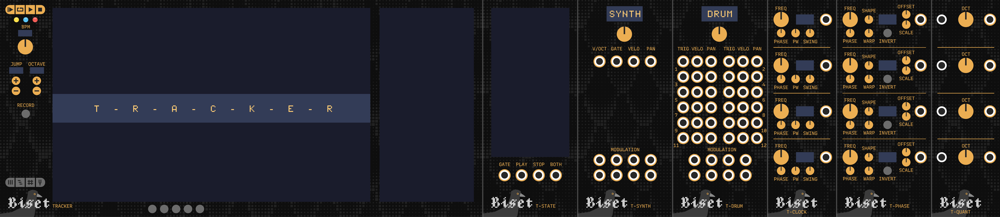
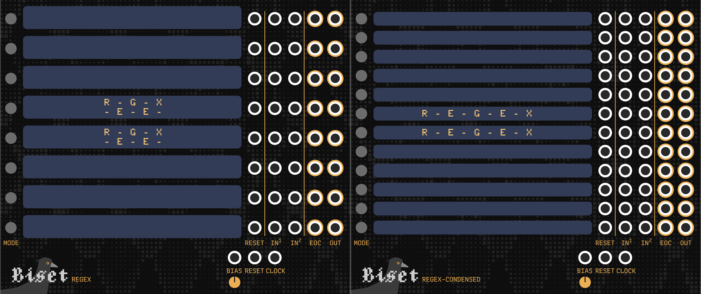
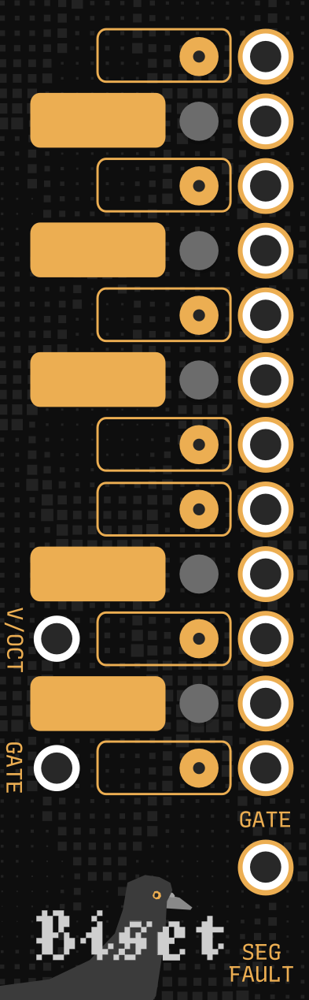

# Biset

**Biset** sequencing / performing modules.

## Tracker

**Tracker** is a series of modules building a complex sequencer based on
**patterns** arranged in a **timeline**.
It can be used to build complex **tracks** or for **live performance**.

[Tracker modules](./doc/Manual-Tracker.pdf)

## Regex

**Regex** and **Regex-Condensed** are **live coding** modules. They can generate
**clock** (rythm), **pitch** and **modulation** sequences.

[Regex modules](./Manual-Regex.pdf)

## Other modules

### Segfault

**Segfault** is designed to be used with **VCV - Midi to CV** module while
performing on your Qwerty or Midi keyboard.
It allows you to send triggers on specific notes and to disable some of them.

It might sound weird but it actually allows you to **rethink your keyboard
layout** !

As an **exemple**, I **disable all the black keys** and use them as **triggers**
to activate other things on my patch.
The **remaining white keys**, which make up the **major scale**, can then be
quantized to any other **7 notes scale** (so most of the scales).
I can then play any 7 notes scale only with the **white keys** and use the
**black keys** gates / triggers to change the synth, the scale / quantizer or
anything else :)

Of course, you can use it in a different way. Like by using the notes triggers
to activate a different synth for every note.

**Segfault** takes **pitch** and **gate** (polyphonic) as input and outputs the
modified gate (if needed).

If the **gate** input is not provided, it is considered **up** by default.
